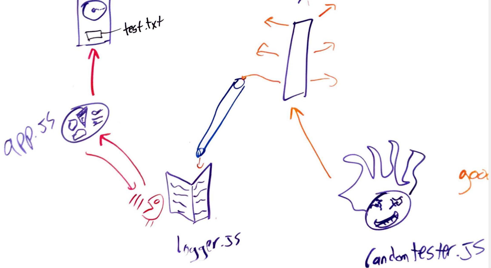

# LAB - 18

## Project Name - lab 18 messages written to a logfile using socket.io

### Author: Student/Group Name Lee-Roy King

### Links and Resources
* [submission PR]()

### Modules

fs 
socket.io
faker 

###### `foo(thing) -> string`
Usage Notes or examples

###### `bar(array) -> array`
Usage Notes or examples

### Setup
#### `.env` requirements

#### Running the app
* node server.js
* node logger.js
* node nonsense.js

now just watch the test.txt file fill up with nonsense logs! including some that are errors! (anything with JSON in it is an error because why not someone has to be the villain)

#### Tests

#### UML
this UML would be identical to the last lab except with 'sockets' instead of net port thangs. so I reused it
